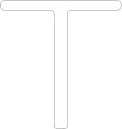
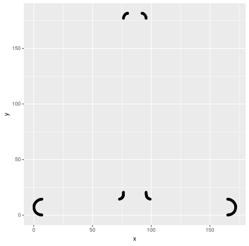
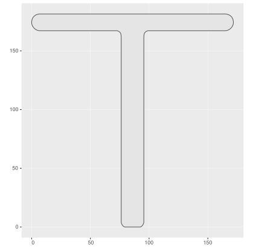
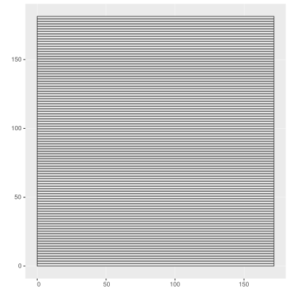
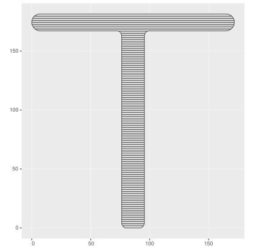
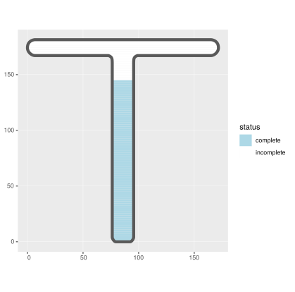

# Conversion of SVG path to shape

The utility handles a subset of paths composed only of line segments.
It only accomodates horizontal, vertical, and lineto commands that use comma separated x & y. 

## Example

### Draw outline in svg editor e.g. Inkscape
Care must be taken in hand drawing to convert all bezier curves to series of segments.
This can be accomplished by adding intermediate points along the curve followed by a convert to segments operation.



### Process path d attribute

The `d` attribute of `<path>` element contains text describing the path to be drawn.
The text is a series of commands (letters) and parameters (numeric values).
The commands are things like moveto (m), vertical (V), horizontal (H), and lineto (l).
A truncated example of the contents of `d` are below:

```
m 79.858905,181.53725 -0.63078,-0.0528 ...
V 20.554833 
l -0.0242,-0.491317 -0.0176,-0.4823 -0.0178,-0.472177 ...
H 6.9331215 
l -0.603946,-0.037 -0.605953,-0.108731 -0.602419,-0.176182 ...
H 165.25882 
l 0.076,0.005 0.21464,0.0214 0.33324,0.04748 0.43182,0.08323...
H 99.071515 
l -0.64464,0.239964 -0.5553,0.264461 -0.4728,0.287852 ...
V 177.07241 
l -0.0339,0.6768 -0.20639,0.75335 -0.34978,0.77466 ...
z
```

Processing these to get a series of coordinates is a prerequisite for creating a shapefile.

```
         x           y
79.8589050 181.5372500
79.2281250 181.4844500
78.5954150 181.1768100
77.9898350 180.6695800
77.4404450 180.0179700
76.9763250 179.2772200
76.6265450 178.5025600
76.4201550 177.7492100
76.3862550 177.0724100
76.3862550  20.5548330
```

#### The coordinates directly from SVG
Plotting the coordinates derived from the `d` attribute of the svg path results in an upside down image.
The image is inverted because the origin of SVG space is the top left,
while the origin of the R's plotting space is lower left.



#### Affine transform to flip horizontally
Transforming the coordinates into a shapefile and transforming the shape to do a horizontal flip yields a shape in the correct orientation.
A horizontal flip is a 180 degree rotation followed by a translation adding the max x and y of the original shape.




### Use produced shape

#### Cut the shape into equal vertical divisions.

Defining a 100 rectangle polygons that evenly divide the space from the min y-value up to the max y-value of the shape and span the x range provide the basis for cutting up the outline.

```R
[[1]]
POLYGON ((0 0, 0 1.81405, 171.7615 1.81405, 171.7615 0, 0 0))
[[2]]
POLYGON ((0 1.81405, 0 3.628099, 171.7615 3.628099, 171.7615 1.81405, 0 1.81405))
[[3]]
POLYGON ((0 3.628099, 0 5.442149, 171.7615 5.442149, 171.7615 3.628099, 0 3.628099))
[[4]]
POLYGON ((0 5.442149, 0 7.256198, 171.7615 7.256198, 171.7615 5.442149, 0 5.442149))
[[5]]
POLYGON ((0 7.256198, 0 9.070248, 171.7615 9.070248, 171.7615 7.256198, 0 7.256198))
...
[[100]]
POLYGON ((0 179.5909, 0 181.405, 171.7615 181.405, 171.7615 179.5909, 0 179.5909))
```




The intersecting these  with the outline gives us a list of 100 shapes that are equal vertical slices of the outline.




#### Use slices
Data can be associated with the slices in such a way as to inform differentially filling them.
This produces the desired effect of "filling up the shape"


